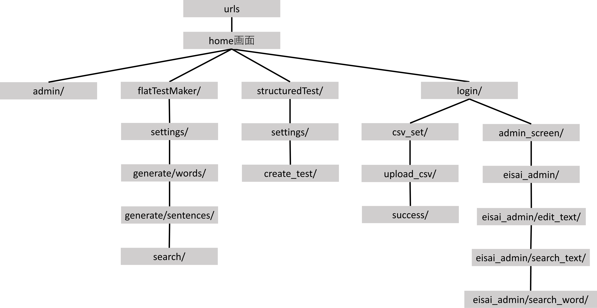

# CloudWordCreator-Django

## 目的

このプロジェクトでは前回作成した英単語の作成・印刷を別のマシーンに任せるシステムを開発したが、windowsの状態に依存し並列処理ができなかった。しかしDjango, SQliteを用いてより高速かつ快適に作成・印刷をするための改良を行う。
さらに拡張性を加味したシステムとして開発を行い英単語だけではなく、漢字テスト・他の教材の印刷などにも将来的に対応していきたい。
更に人工知能を用いてテストが作成が行われるようなシステムも導入する。

## 動作環境

python3.13

## urlsの構成図

以下機能

|urls|機能|
|---|---|
|admin/|管理画面|
|csv_set/|新規データをデータベースに書き込む。csvファイルのみ対応|
|structuredTest/|unit事に分類されたテストを作成する。|
|flatTestMaker/|unit事に分類されていないテストを作成する。検索、穴埋め問題の作成まで対応。|
|admin_screen/|教材の編集、削除をする機能|
|login/|csv_set/とadmin_screen/を保護するためのログイン画面|

## ネットワーク構成図

